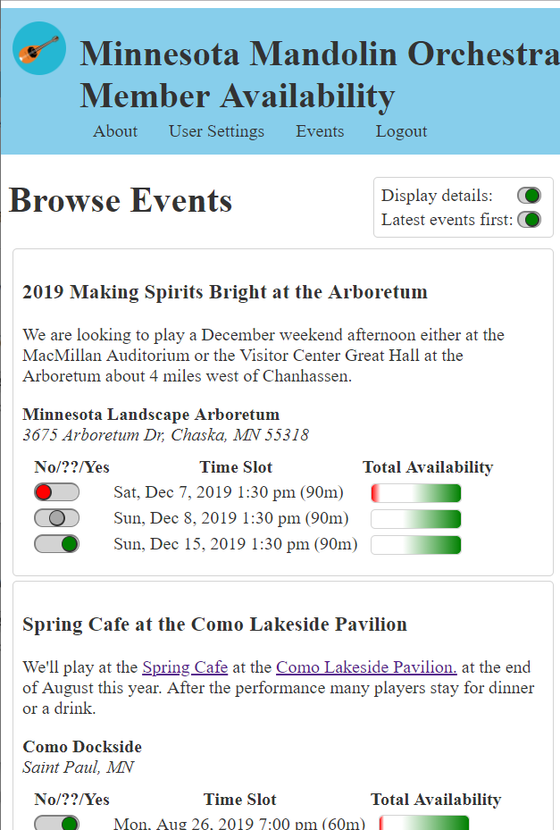
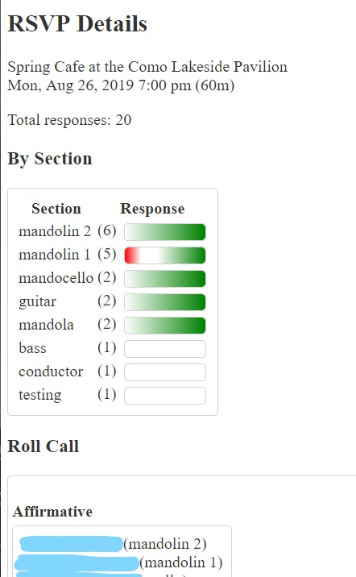

# Cat Wrangler
Cat Wrangler presents a web-based interface to a database collecting
users' availability for time scheduling options.
Individual user responses are not published, except to authenticated event
managers, but Cat Wrangler presents aggregate availability to individuals.

The default view that the Cat Wrangler UI displays presents event
descriptions and allows users to express their availability to attend 
potential event dates.



Site administrators can view summarized and individual responses



## Installation
```sh
git clone https://github.com/jonathanlb/cat-wrangler
cd cat-wrangler
npm install
## Edit configuration files in config/
npm run config
npm run build
DEBUG='*' npm run start
# point your browser to http://localhost:3000/index.html
```

### Installation Options
There are client/front-end configuration options in [config/clientConfig.js](config/clientConfig.js) and server configuration options in [config/serverConfig.js](serverConfig.js).
Also, you can customize the content under the "About" tab by creating a `config/about.html` file.

Install your options by running `npm run config` to copy these files into `src/client|server` and `public` for installation/execution.
Do not commit the changes written!  You can restore the defaults with `npm run unconfig`.

You can run the client-facing webserver and the nodejs back-end on separate
hosts.
Just edit the exported object in [config/clientConfig.js](config/clientConfig.js) to
include a `serverPrefix` field with the route to your host,
e.g. `http://192.168.4:3005`, run `npm run config; npm run build`, and copy the contents of
the [public](public) directory under your webserver.

If you want to specify your own style, say to change colors or spacing, write your css settings to [public/override-style.css](public/override-style.css).

## Event Configuration
Event and user creation is not available from the web.
Use the tools in [src/admin](src/admin) to create events and users.

### Create a Venue
```bash
DEBUG='*' node src/admin/createVenue.js data/mmo.sqlite3 'Emerald Palace' '1 Yellow Brick Rd, Emerald City, OZ, 98765'
```

### Create an Event
Create a event config json file of the form

```json
{
   "name": "Extravaganza",
   "venue": {
     "name": "The Dive",
     "address": "37 Lake St"
     /* alternatively, you can specify the venue id e.g. "id": 37 */
   },
   "description": "# Best Test Event Evuh\nRSVP or ....",
   "dates": [
     { "yyyymmdd": "2018-12-01", "hhmm": "8:39", "duration": "45m" },
     { "yyyymmdd": "2018-12-01", "hhmm": "9:06", "duration": "45m" }
   ]
}
```

Then run:

```bash
DEBUG='*' node src/admin/createEvent.js event.config.json data/mmo.sqlite3
```

### Create Participants
Be sure to quote user names, passwords, emails, and any arguments with a space.

```bash
DEBUG='*' node src/admin/createParticipant.js data/mmo.sqlite3 'Spectacular Soloist' 'shh password' 'email@xxx.org' false 'Contra Zither'
```

Afterwards, users can log into the Cat Wrangler website with their user name and password, select an event, and RSVP to the time options.

## Troubleshooting

### Bcrypt Fails at Runtime
[bcrypt](https://github.com/kelektiv/node.bcrypt.js/) doesn't always install cleanly.  The precompiled module might [fail with a symbol lookup error.](https://github.com/kelektiv/node.bcrypt.js/issues/656)  Fix the module with:

```
npm rebuild bcrypt --build-from-source
```

### Sqlite Installation
By default, Cat Wrangler uses Sqlite for persistence via the [sqlite3](https://www.npmjs.com/package/sqlite3) interface module, which can be tricky to install.

- **node-gyp fails with a python stack:** Check your default python installation with `python --version`.  If that shows python 3.x, then specify a python 2.7 during installation: `npm install --python=<your-path-to-python2.7>`
- **install fails at 'node-pre-gyp install --fallback-to-build':** The npm-sqlite build environment is sensitive to the version of NPM.  As of December 2018, using [nvm, the node version manager](https://github.com/creationix/nvm) to pin node to version 8.9.3 will enable a successful launch of the build.  Another solution can be:
```npm --build-from-source install sqlite3```

## UI Development
To view, demo, or debug user-interface widgets, run `npm run build-snippets` then point your browser to the `snippets` directory under the Cat Wrangler server.
